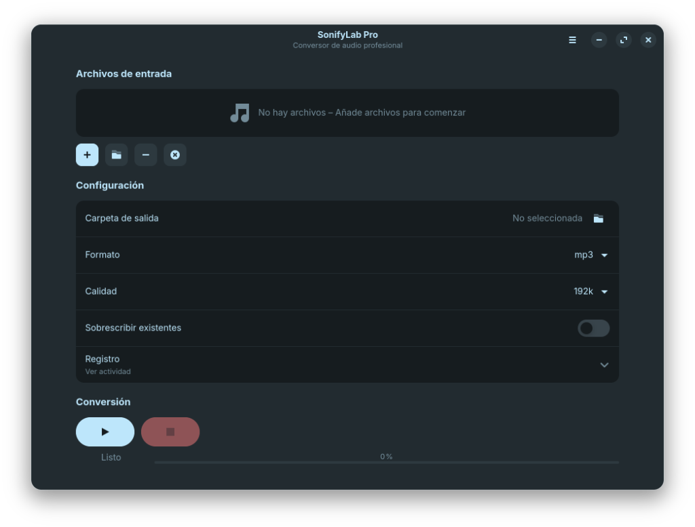

# SonifyLab Pro


> 🎵 **Herramienta profesional de conversión de audio por lotes**

[](https://www.gnu.org/licenses/gpl-3.0)
[](https://www.python.org/downloads/)
[]()

---

## 📖 Descripción

**SonifyLab Pro** es una aplicación de escritorio que te permite convertir fácilmente archivos de audio entre múltiples formatos. Con una interfaz gráfica intuitiva basada en PyQt5, puedes agregar archivos individuales o carpetas completas, seleccionar el formato de salida, ajustar el bitrate y gestionar el proceso de conversión de manera eficiente.



---

## ✨ Características

| Característica | Descripción |
|----------------|-------------|
| 🔄 **Conversión por lotes** | Convierte múltiples archivos simultáneamente |
| 🎵 **10 formatos soportados** | mp3, wav, flac, aac, ogg, m4a, wma, opus, aiff, alac |
| ⚙️ **Personalización** | Selecciona bitrate (128k-320k) y formato de salida |
| 🚀 **Procesamiento paralelo** | Aprovecha todos los núcleos de tu CPU |
| 📊 **Progreso en tiempo real** | Velocidad de conversión y tiempo restante |
| 📁 **Añadir carpetas** | Escanea recursivamente carpetas completas |
| 📝 **Registro detallado** | Historial de conversiones realizadas |
| 🌍 **Preparado para i18n** | Interfaz lista para traducciones |

---

## 📋 Requisitos

- **Python** 3.8 o superior
- **FFmpeg** instalado y accesible desde terminal
- **Sistema operativo:** Linux, Windows o macOS

---

## 🚀 Instalación

### Linux (Ubuntu, Zorin OS, Linux Mint, Debian)

```bash
# Clonar el repositorio
git clone https://github.com/discodiski/SonifyLab.git
cd SonifyLab

# Ejecutar instalador automático
chmod +x install.sh
./install.sh
```

El instalador automáticamente:
- ✅ Instala dependencias del sistema (Python, FFmpeg)
- ✅ Crea un entorno virtual aislado
- ✅ Instala PyQt5 y dependencias de Python
- ✅ Crea acceso directo en el menú de aplicaciones

### Windows

```powershell
# Clonar el repositorio
git clone https://github.com/discodiski/SonifyLab.git
cd SonifyLab

# Instalar dependencias
pip install -r requirements.txt

# Ejecutar
python SonifyLab.py
```

> **Nota:** En Windows necesitas [FFmpeg](https://ffmpeg.org/download.html) instalado y añadido al PATH.

### macOS

```bash
# Instalar FFmpeg con Homebrew
brew install ffmpeg

# Clonar e instalar
git clone https://github.com/discodiski/SonifyLab.git
cd SonifyLab
pip3 install -r requirements.txt
python3 SonifyLab.py
```

---

## 🎯 Uso

### Desde el menú de aplicaciones (Linux)
1. Busca "SonifyLab" en el menú de aplicaciones
2. ¡Listo para usar!

### Desde terminal
```bash
cd ~/ruta/a/SonifyLab
source venv/bin/activate  # Solo Linux/macOS
python3 SonifyLab.py
```

### Flujo de trabajo
1. **Añadir archivos:** Click en "Añadir archivos" o "Añadir carpeta"
2. **Configurar:** Selecciona formato de salida y bitrate deseado
3. **Carpeta de salida:** Selecciona dónde guardar los archivos convertidos
4. **Convertir:** Click en "Iniciar Conversión"
5. **Monitorear:** Observa el progreso en tiempo real

---

## 📁 Estructura del proyecto

```
SonifyLab/
├── SonifyLab.py       # Código principal de la aplicación
├── requirements.txt   # Dependencias de Python
├── install.sh         # Instalador para Linux
├── icono.png          # Icono de la aplicación
├── icono.ico          # Icono para Windows
├── pantallaprincipal.png  # Captura de pantalla
├── LICENSE            # Licencia GPL-3.0
└── README.md          # Este archivo
```

---

## 🔧 Formatos soportados

| Formato | Extensión | Descripción |
|---------|-----------|-------------|
| MP3 | `.mp3` | El más compatible, buena compresión |
| WAV | `.wav` | Sin pérdida, archivos grandes |
| FLAC | `.flac` | Sin pérdida, comprimido |
| AAC | `.aac` | Alta calidad, usado en Apple |
| OGG | `.ogg` | Código abierto, buena calidad |
| M4A | `.m4a` | Contenedor AAC de Apple |
| WMA | `.wma` | Formato de Microsoft |
| OPUS | `.opus` | Moderno, excelente compresión |
| AIFF | `.aiff` | Sin pérdida, formato Apple |
| ALAC | `.alac` | Apple Lossless |

---

## 🛠️ Desarrollo

### Ejecutar desde código fuente
```bash
# Clonar repositorio
git clone https://github.com/discodiski/SonifyLab.git
cd SonifyLab

# Crear entorno virtual
python3 -m venv venv
source venv/bin/activate

# Instalar dependencias
pip install -r requirements.txt

# Ejecutar
python SonifyLab.py
```

### Crear ejecutable con PyInstaller
```bash
pip install pyinstaller
pyinstaller --onefile --windowed \
  --icon=icono.ico \
  --add-data "icono.png:." \
  --name "SonifyLab Pro" \
  SonifyLab.py
```

---

## 📄 Licencia

Este proyecto está licenciado bajo la **GNU General Public License v3.0**.

Ver el archivo [LICENSE](LICENSE) para más detalles.

---

## 👤 Autor

**Discaury Salas**

---

## 🤝 Contribuciones

Las contribuciones son bienvenidas. Por favor:

1. Haz fork del proyecto
2. Crea una rama para tu feature (`git checkout -b feature/nueva-funcionalidad`)
3. Commit tus cambios (`git commit -m 'Añadir nueva funcionalidad'`)
4. Push a la rama (`git push origin feature/nueva-funcionalidad`)
5. Abre un Pull Request

---

## ⭐ Agradecimientos

- [FFmpeg](https://ffmpeg.org/) - Motor de conversión de audio
- [PyQt5](https://www.riverbankcomputing.com/software/pyqt/) - Framework de interfaz gráfica
